## Employee Survey Dataset

# Introduction
This is a power BI project on HR survey analysis called Employee Survey. The project is to analyze and derive insights to answer crucial questions and help the Employee make data driven decision.

# Problem Statement
- Which survey questions did respondents agree with or disagree with most?
- Do you see any patterns or trends by department or role?
- As an employer, what steps might you take to improve employee satisfaction based on the survey results?
  

# Skills Demonstrated
The following power BI were incorporated:
-	Data transformation
-	Data cleaning
-	Data sorting
-	New measures
-	Filters
-	Page navigation

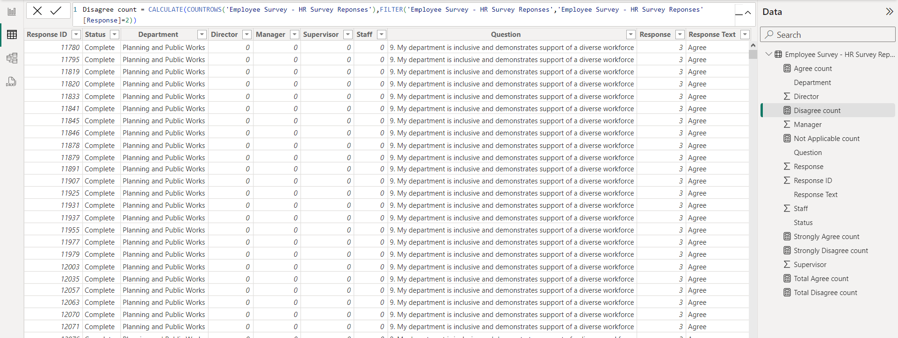

# Data sourcing 
The Employee Survey Responses are actual responses from an employee engagement survey conducted by Pierce County WA and completed voluntarily by government employees. The dataset is a Single table and contains 14,725 records. The total number of fields is 10.
https://docs.google.com/spreadsheets/d/1nbhfp2ModgqDAPveYQG9CknRw2PYJQxbOTs3xSKOB
8E/edit#gid=61186505

# Data transformation
Data cleaning and transformation was carried out using power query. After scrutinizing all the columns, they were found to be valid and devoid of empty cells and errors. However, it was highly important to replace value for empty cells.
Data was efficiently cleaned and transformed with power query editor of Power BI ( image) some of the applied steps included
-	Making first rows as headers in the dataset
-	Format data cells by filling empty cells, replacing null cells with values
-	Datatype then change from “DECIMAL” TO “WHOLE NUMBER”
-	Close and apply

Modelling
Automatically derived relationships are adjusted to remove and replace unwanted relationships with the required.

The model is a star schema.
There are 5-dimension tables and 1 fact table. The dimension tables are all joined to the fact table with one-many relationship

# Analysis & Visualizations
The report comprises of 2 pages;
1.	Employee survey responses
2.	Pattern trend by role
3.	Pattern trend by department
You can interact with the report here (link to powerbi)

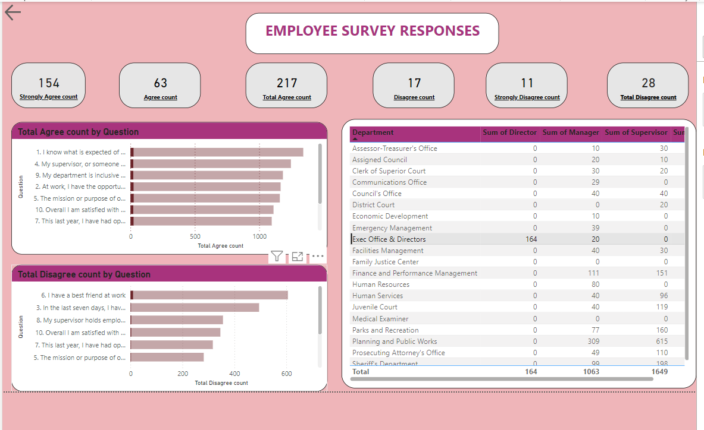
From the dashboard, its observed that 217 respondent total agree and 28 Total disagree. Question 1 ( I know what is expected by me at work ) was Total agree with and Question 6 ( I have bestfriend at work ) was Total Disagree with.

Question 1 Responses; 

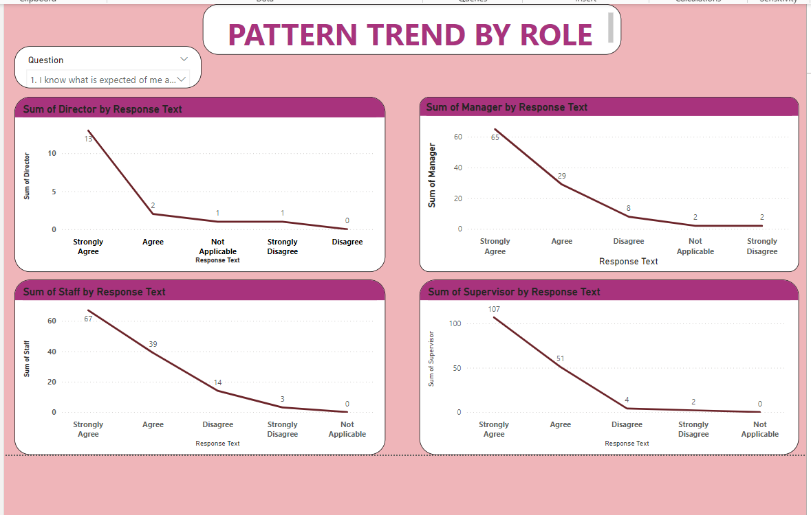

From the dashboard, its observed that 
-	13 strongly agreed,2 agreed, 1 strongly disagree, 0 disagree and 1 not applicable as per directors
-	65 strongly agreed,29 agreed, 2 strongly disagree, 8 disagree and 2 not applicable as per Managers
-	65 strongly agreed, 39 agreed,3 strongly disagree, 14 disagree and 0 not applicable as per Staff
-	107 strongly agreed,51 agreed,2 strongly disagree, 4 disagree and 0 not applicable as per supervisor

Question 2 Responses; 

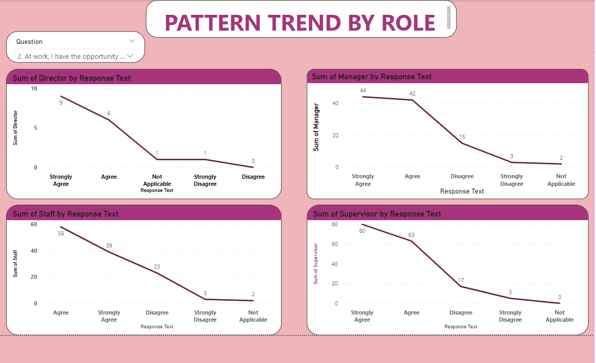

From the dashboard, its observed that 
-	9 strongly agreed, 6 agreed, 1 strongly disagree, 0 disagree and1 not applicable as per directors
-	44 strongly agreed, 42 agreed, 3 strongly disagree, 15 disagree and 2 not applicable as per Managers
-	58 strongly agreed, 48 agreed, 3 strongly disagree, 23 disagree and 2 not applicable as per Staff
-	80 strongly agreed, 63 agreed, 5 strongly disagree, 17 disagree and 0 not applicable as per supervisor

Question 3 Responses; 

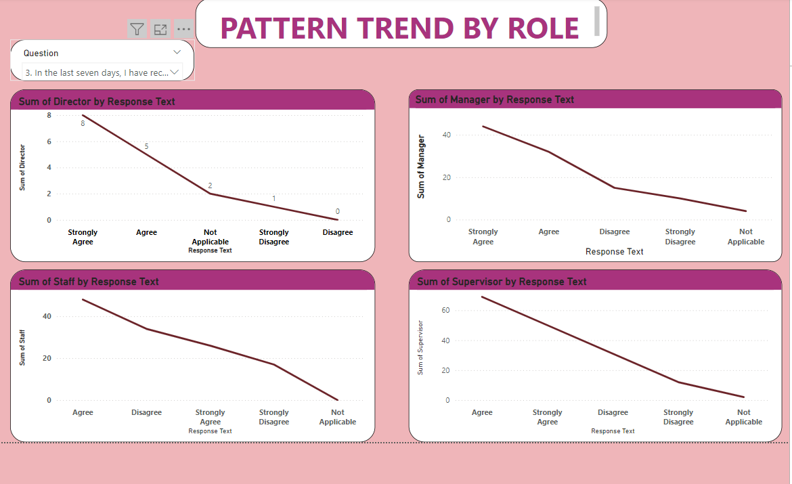

From the dashboard, its observed that 
-	8 strongly agreed, 5 agreed, 1 strongly disagree, 0 disagree and 33 not applicable as per directors
-	44 strongly agreed, 32 agreed, 10 strongly disagree, 15 disagree and 4 not applicable as per Managers
-	26 strongly agreed, 48 agreed, 17 strongly disagree, 34 disagree and 0 not applicable as per Staff
-	50 strongly agreed, 69 agreed,12 strongly disagree, 31 disagree and 2 not applicable as per supervisor

Question 4 Responses; 

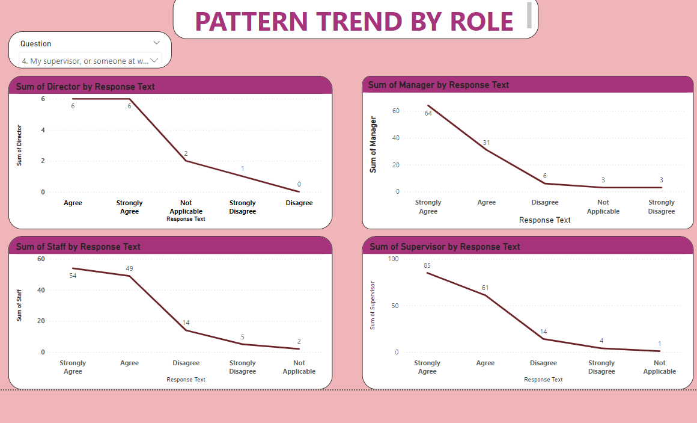

From the dashboard, its observed that
-	6 strongly agreed,6 agreed, 1 strongly disagree, 0 disagree and 2 not applicable as per directors
-	64 strongly agreed, 31 agreed, 3 strongly disagree, 6 disagree and 3 not applicable as per Managers
-	54 strongly agreed, 49 agreed, 5 strongly disagree, 14 disagree and 2 not applicable as per Staff
-	85 strongly agreed, 61 agreed,4 strongly disagree, 14 disagree and 1 not applicable as per supervisor

Question 5 Responses; 

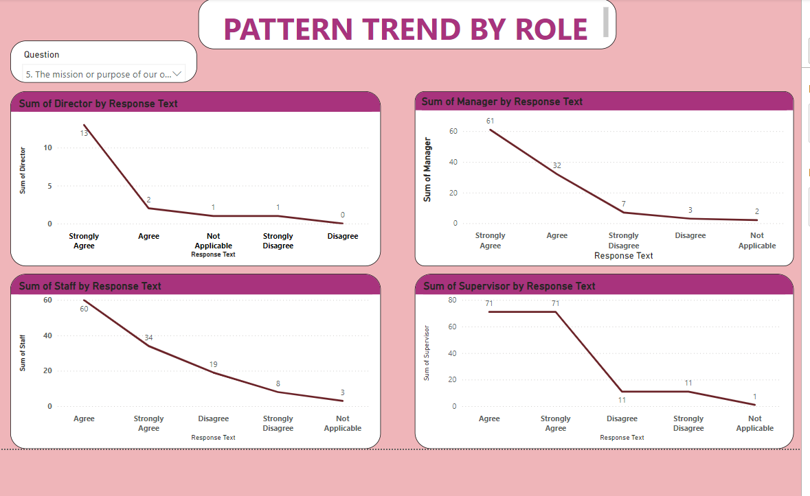

From the dashboard, its observed that
-	13 strongly agreed, 2 agreed, 1 strongly disagree, 0 disagree and 1 not applicable as per directors
-	61 strongly agreed, 32 agreed, 7 strongly disagree, 3 disagree and 2 not applicable as per Managers
-	34 strongly agreed, 60 agreed, 8 strongly disagree, 19 disagree and 3 not applicable as per Staff
-	71 strongly agreed, 71 agreed, 11 strongly disagree, 11 disagree and 1 not applicable as per supervisor

Question 6 Responses; 

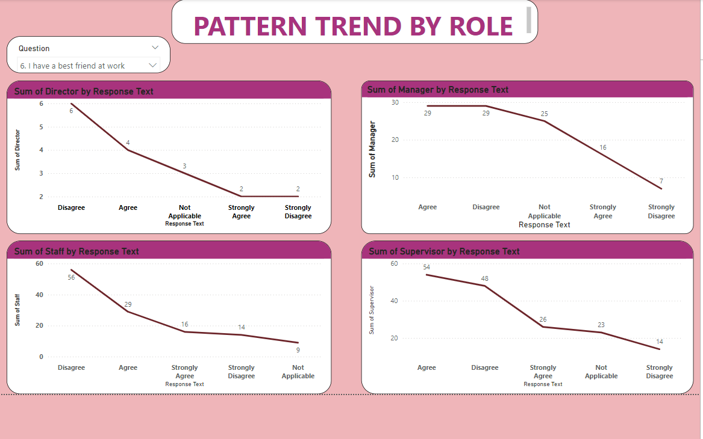

From the dashboard, its observed that
-	2 strongly agreed, 4 agreed, 2 strongly disagree, 6 disagree and 3 not applicable as per directors
-	16 strongly agreed, 29 agreed, 7 strongly disagree, 29 disagree and 25 not applicable as per Managers
-	16 strongly agreed, 29 agreed, 14 strongly disagree, 56 disagree and 9 not applicable as per Staff
-	26 strongly agreed, 54 agreed,14 strongly disagree, 48 disagree and 23 not applicable as per supervisor

Question 7 Responses; 

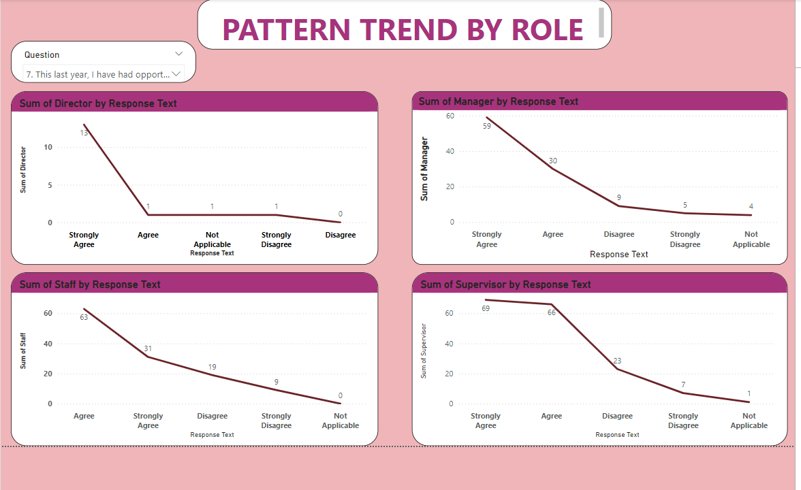

From the dashboard, its observed that
- 13 strongly agreed, 1 agreed, 1 strongly disagree, 0 disagree and 1 not applicable as per directors
-	59 strongly agreed, 30 agreed, 5 strongly disagree, 9 disagree and 4 not applicable as per Managers
-	31 strongly agreed, 63 agreed, 17 strongly disagree, 19 disagree and 0 not applicable as per Staff
-	69 strongly agreed, 66 agreed,7 strongly disagree, 23 disagree and 1 not applicable as per supervisor

Question 8 Responses; 

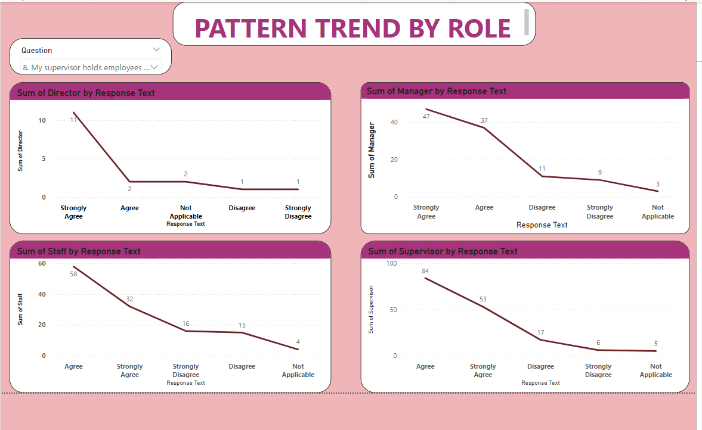

From the dashboard, its observed that
-	11 strongly agreed, 2 agreed, 1 strongly disagree, 1 disagree and 2 not applicable as per directors
-	47 strongly agreed, 37 agreed, 9 strongly disagree, 11 disagree and 3 not applicable as per Managers
-	16 strongly agreed, 58 agreed, 32 strongly disagree, 15 disagree and4 not applicable as per Staff
-	53 strongly agreed, 84 agreed, 6 strongly disagree, 17 disagree and 5 not applicable as per supervisor

Question 9 Responses; 

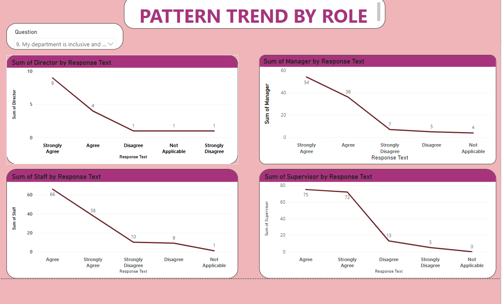

From the dashboard, its observed that
-	9 strongly agreed, 4 agreed, 1 strongly disagree, 1 disagree and 1 not applicable as per directors
-	54 strongly agreed, 36 agreed, 7 strongly disagree, 5 disagree and 4 not applicable as per Managers
-	38 strongly agreed, 66 agreed, 10 strongly disagree, 9 disagree and 1 not applicable as per Staff
-	72 strongly agreed, 75 agreed, 5 strongly disagree, 13 disagree and 0 not applicable as per supervisor

Question 10 Responses; 

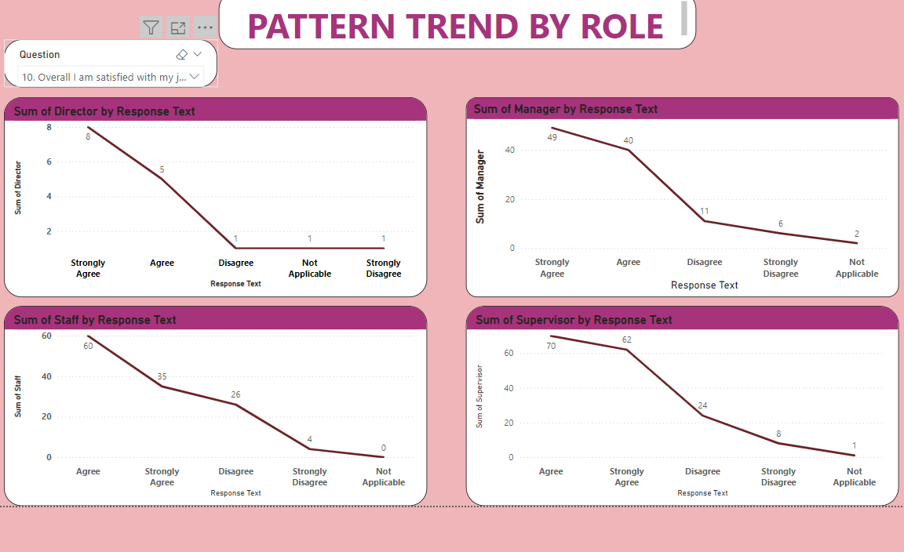

From the dashboard, its observed that
From the dashboard, its observed that 
-	8 strongly agreed, 5 agreed, 1 strongly disagree, 1 disagree and 1 not applicable as per directors
-	49 strongly agreed, 40 agreed, 6 strongly disagree, 11 disagree and 2 not applicable as per Managers
-	35 strongly agreed, 60 agreed, 4 strongly disagree,26 disagree and 0 not applicable as per Staff
-	62 strongly agreed, 70 agreed, 8 strongly disagree, 31 disagree and 1 not applicable as per supervisor

# Conclusion and recommendation
From the survey responses, its highlights a number of crucial areas where work can be done to improve communication, manage workloads, promote professional growth, create a good work atmosphere, and regularly collect feedback in order to increase employee happiness.
# important conclusions
Communication: managers should communicate more frequently and transparently.
workload: Establish a balance between duties and offer tools for stress relief.
Professional development: provide additional training and possibilities for clear growth; foster a culture of positivity, inclusivity, and collaboration; establish a feedback mechanism; conduct surveys on a regular basis and make sure that the results are used to inform decisions. Putting these suggestions into practice may benefit the business as a whole and increase employee satisfaction and retention rates.

